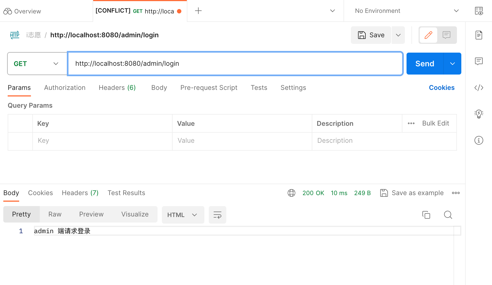

# 1、初始化项目
例如项目名为 `node-server-demo`
```bash
mkdir node-server-demo
```
进入 `node-server-demo` [文件夹](https://so.csdn.net/so/search?q=%E6%96%87%E4%BB%B6%E5%A4%B9&spm=1001.2101.3001.7020)内，初始化 `package.json`文件
```bash
cd node-server-demo
```
初始化 `package.json`文件
```bash
npm init -y
```

# 2、安装 Express.js Web 服务框架
```bash
npm install express
```
# 3、创建 app.js 主入口文件, 并且实现 GET、POST请求
```javascript
const express = require('express');
const app = express();

const port = 8080;

app.use(express.json());

app.get('/', (req, res) => {
  res.send('hello');
});

app.get('/get', (req, res) => {
  const { a } = req.query;
  res.send(a);
});

app.post('/post', (req, res) => {
  const jsonData = req.body;
  res.json(jsonData);
});

app.listen(port, () => {
  console.log(`node服务已启动 端口号为： ${port}`);
});
```
# 4、启动服务
```bash
node app.js
```

# 5、请求测试
请求测试，使用 postman或者 apifox
`GET` 请求

`POST` 请求

到这里 node 简单搭建服务端就完成。
# 6、接口按路由分模块
**全部接口写在 app.js中不好维护，臃肿**，实际开发肯定是要分模块的
假设现在有两个路由模块：

- `appRouter.js` 专门处理 app 端接口服务
- `adminRouter.js` 专门处理 admin 端接口服务

创建 `router` 文件夹 存放 对应路由文件
`appRouter.js` 路由文件内容
```javascript
const express = require('express');
const app = express.Router();

app.get('/login', (req, res) => {
	res.send('app 端请求登录')
});

module.exports = app
```
`adminRouter.js` 路由文件内容
```javascript
const express = require('express');
const admin = express.Router();

admin.get('/login', (req, res) => {
	res.send('admin 端请求登录')
});

module.exports = admin
```
此时文件目录对照：

在 `app.js` 主入口中注册路由
```javascript
const express = require('express');

const appRouter = require('./router/appRouter')
const adminRouter = require('./router/adminRouter')
const app = express();
const port = 8080;

app.use(express.json());

app.use('/app', appRouter)
app.use('/admin', adminRouter)

app.get('/', (req, res) => {
  res.send('hello');
});

app.get('/get', (req, res) => {
  const { a } = req.query;
  res.send(a);
});

app.post('/post', (req, res) => {
  const jsonData = req.body;
  res.json(jsonData);
});

app.listen(port, () => {
  console.log(`node服务已启动 端口号为： ${port}`);
});
```
启动测试 访问 `/app`，`/admin` 可以看到两个都生效了


# 7、跨域设置
安装跨域插件 [官方文档](https://github.com/expressjs/cors)
```bash
npm install cors
```
在 `app.js` 中引用, 这里要注意 `app.use()`代码一定要放在 `require()` 下面，否则可能会出现不生效，使用其他插件也是一样要注意
```javascript
const cors = require('cors')

app.use(cors())
```
# 8、静态页面处理
创建 `public` 或者 `src`目录文件夹，随便取什么名字都可以，我这边html文件放在了 `public/pages/` 下面
此时文件结构：

编写访问 `index.html` 的路由，我这边图简单直接 `app.js` 中的 `/` 根路由访问 `index.html`文件,也比较合理
```javascript
app.get('/', (req, res) => {

    const filePath = __dirname + '/public/pages/index.html';

    res.sendFile(filePath);
});
```
完整 `app.js`
```javascript
const express = require('express');

const appRouter = require('./router/appRouter')
const adminRouter = require('./router/adminRouter')
const app = express();
const port = 8080;

app.use(express.json());

app.use('/app', appRouter)
app.use('/admin', adminRouter)

app.get('/', (req, res) => {

  const filePath = __dirname + '/public/pages/index.html';

  res.sendFile(filePath);
});

app.get('/get', (req, res) => {
  const { a } = req.query;
  res.send(a);
});

app.post('/post', (req, res) => {
  const jsonData = req.body;
  res.json(jsonData);
});

app.listen(port, () => {
  console.log(`node服务已启动 端口号为： ${port}`);
});
```
访问 `/` 测试 已经生效
)
# 9、部署 vercel
首先得准备一个 Vercel账户，这个就不讲解了
电脑全局安装 Vercel脚手架
```bash
npm install -g vercel
```
登录 Vercel
```bash
vercel login
```
在 `node.js`项目根目录创建 `vercel.json` 文件, 这个文件的内容基本是固定，如果部署出现 404，请检查 `/app 或者 /admin` 路由注册是否正常
```json
{
  "version": 2,
  "builds": [
    {
      "src": "app.js",
      "use": "@vercel/node"
    }
  ],
  "routes": [
    {
      "src": "/(.*)",
      "dest": "app.js"
    }
  ]
}
```
此时目录结构：

将当前项目 预览部署到 Vercel中, 在 node.js项目根目录执行以下命令, 部署完成之后会给一个预览地址和部署地址，
```bash
vercel
```

将当前项目 预览部署到 Vercel 正式环境中中, 在 node.js项目根目录执行以下命令, 部署完成之后会给一个正式地址和部署地址
```bash
vercel --prod
```

到这里内容就全部结束了
# 10、完整Demo代码地址
附上 [demo地址](https://github.com/poboll/node-server-demo)
